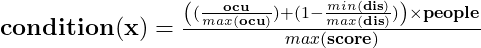
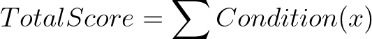
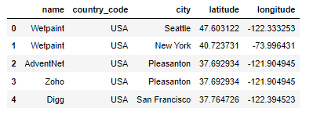
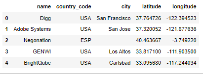
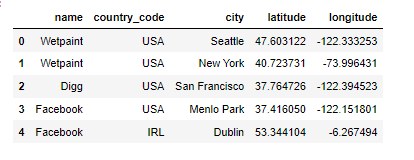
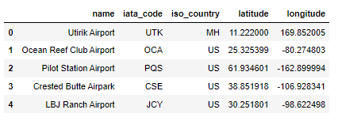
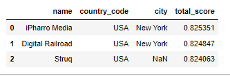
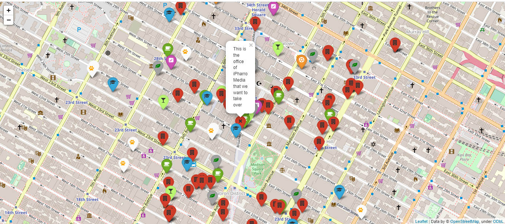
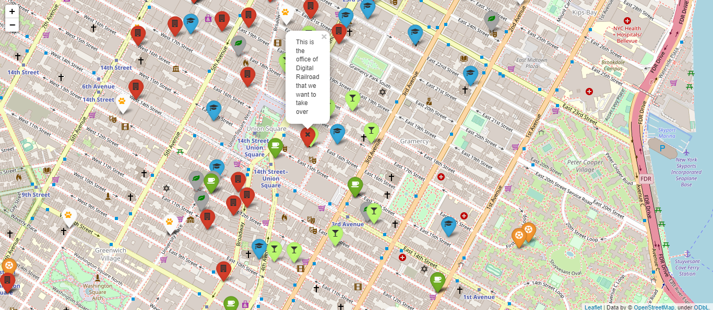
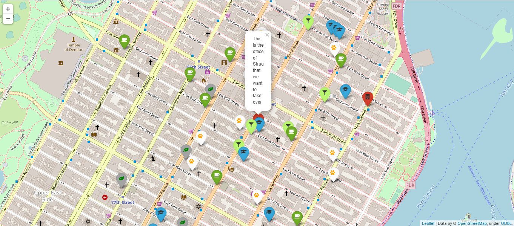

# Best Location for a Gamming Company

## Basic Information:
- Author: Sergi Portolés
- Project III for the Data Analytics Bootcamp in Ironhack (geospatial data)

## Main Objective of the Project:

Find the best location for a Gaming Company given the following conditions:

- Designers like to go to design talks and share knowledge. There must be some nearby companies that also do design.
- 30% of the company staff have at least 1 child.
- Developers like to be near successful tech startups that have raised at least 1 Million dollars.
- Executives like Starbucks A LOT. Ensure there's a starbucks not too far.
- Account managers need to travel a lot.
- Everyone in the company is between 25 and 40, give them some place to go party.
- The CEO is vegan.
- If you want to make the maintenance guy happy, a basketball stadium must be around 10 Km.
- The office dog—"Dobby" needs a hairdresser every month. Ensure there's one not too far away.

Company staff:

- 20 Designers
- 5 UI/UX Engineers
- 10 Frontend Developers
- 15 Data Engineers
- 5 Backend Developers
- 20 Account Managers
- 1 Maintenance guy that loves basketball
- 10 Executives
- 1 CEO/President.

## Data Sources Used:
| Source   |      Type      |  Data extracted  |
|----------|:-------------:|------:|
| [Crunchbase](https://www.crunchbase.com/)|  MongoDB1 | Database of start-ups |
| [Foursquare](https://foursquare.com/) | API | Places near location |
|[Bing](https://www.bing.com/)|Web Scrapping|Seacrh for Booking URL for a certain city
| [OurAirports](https://ourairports.com/) | CSV1 | Airport location database |
 
1 Files not included in the repository
 
## Python Libraries Used:
 
| Library   |      Use     |
|----------|:-------------:|
| Pandas | Data Frame manipulation |
| Requests | HTTP Calls |
| Pymongo | MongoDB queries |
| Time | Sleep Function |
| Urllib | Url encode |
| dotenv | Import tokens |
| Os | Set paths |
| Tqdm | Show progress bar |
| folium | Plot maps |
| Geopy | Calculate distances |
## File Structure:

### *main.py*

Python file that returns the best 3 locations, plots them and save a database of top 200 locations 1

1***Important**: Running this file might require a long processing time*

### ./src/

- ***criteria.py*** &rarr; This file generates all the paramters used to evaluate the locations
- ***database.py*** &rarr; This file contains the functions to generate and save (csv format) the datasets for the condition 1, 3 and 5
- ***queries.py*** &rarr; This file contains the functions needed to query MongoDB and Foursquare API
- ***score.py***  &rarr; This file contains all the functions needed to calculate the score of each location

### ./data/

This folder contains all the databases generated in format csv:
- World Airports database
- Companies that raised more than 1 million USD database
- Offices for design companies database
- Offices locations database
- Offices locations database with scores for conditions 1, 3 and 5
- Top 200 offices locations database with total score
## Criteria to Find the Best Locations

### Initial considerations:

1. All the workers are considered equal (including the dog)
2. The closest is a location the better
3. The more locations that meet the criteria the better until a maximum number where more locations do not give an extra value

With this consideration a formula was generated

### Score formula

**condition(x)** &rarr; Conditions score from x=1 to x=9.

**ocu** &rarr; Number of occurrences for a given condition to a maximum "max(ocu)".

**max(ocu)** &rarr; Maximum number of locations that are considered enough to satisfy a given condition.

**dis** &rarr; Distance between two locations.

**min(dis)** &rarr; Minimum distance from the location and places that meet the condition.

**min(dis)** &rarr; Maximum distance from the location that can be situated a place that meets the condition.

**people** &rarr; Number of people in the company that satify a given condition

**max(score)** &rarr; The maximum score possible of the sum of all conditions score

## Process to Find the Best Locations:

### 1. Definig Conditions Parameters:

<table border="1" class="dataframe" style="font-size:12px;text-align:center">
  <thead>
    <tr>
      <th></th>
      <th>Condition 1</th>
      <th>Condition 2</th>
      <th>Condition 3</th>
      <th>Condition 4</th>
      <th>Condition 5</th>
      <th>Condition 6</th>
      <th>Condition 7</th>
      <th>Condition 8</th>
      <th>Condition 9</th>
    </tr>
  </thead>
  <tbody>
    <tr>
      <th>Maximum Number</th>
      <td>10</td>
      <td>5</td>
      <td>20</td>
      <td>1</td>
      <td>1</td>
      <td>30</td>
      <td>2</td>
      <td>1</td>
      <td>1</td>
    </tr>
    <tr>
      <th>Maximum Distance (Km)</th>
      <td>5</td>
      <td>3</td>
      <td>20</td>
      <td>2</td>
      <td>50</td>
      <td>3</td>
      <td>2</td>
      <td>10</td>
      <td>4</td>
    </tr>
    <tr>
      <th>People from the staff</th>
      <td>20</td>
      <td>26</td>
      <td>15</td>
      <td>10</td>
      <td>20</td>
      <td>87</td>
      <td>1</td>
      <td>1</td>
      <td>1</td>
    </tr>
    <tr>
      <th>Description</th>
      <td>Designers like to go to design talks and share knowledge. There must be some nearby companies that also do design.</td>
      <td>30% of the company staff have at least 1 child.</td>
      <td>Developers like to be near successful tech startups that have raised at least 1 Million dollars.</td>
      <td>Executives like Starbucks A LOT. Ensure there\'s a starbucks not too far.</td>
      <td>Account managers need to travel a lot.</td>
      <td>Everyone in the company is between 25 and 40, give them some place to go party.</td>
      <td>The CEO is vegan.</td>
      <td>If you want to make the maintenance guy happy, a basketball stadium must be around 10 Km.</td>
      <td>The office dog Dobby needs a hairdresser every month. Ensure there\'s one not too far away.</td>
    </tr>
    <tr>
      <th>Source</th>
      <td>Crunchbase</td>
      <td>Foursquare</td>
      <td>Crunchbase</td>
      <td>Foursquare</td>
      <td>OurAirports</td>
      <td>Foursquare</td>
      <td>Foursquare</td>
      <td>Foursquare</td>
      <td>Foursquare</td>
    </tr>
    <tr>
      <th>Categories</th>
      <td>[tags_list, description, name]</td>
      <td>[12055, 12056, 12057, 12058, 12059, 12060, 12061, 12062]</td>
      <td>total_money_raised</td>
      <td>[13032]</td>
      <td>None</td>
      <td>[13003, 10032]</td>
      <td>[13377]</td>
      <td>[18008]</td>
      <td>[11134]</td>
    </tr>
    <tr>
      <th>Query</th>
      <td>[Dd]esign</td>
      <td>None</td>
      <td>More than 1,000,000</td>
      <td>Starbucks</td>
      <td>None</td>
      <td>None</td>
      <td>None</td>
      <td>None</td>
      <td>None</td>
    </tr>
    <tr>
        <th>Tag</th>
        <td>Design Company</td>
        <td>Education Center</td>
        <td>Succesful Start-up</td>
        <td>Starbucks</td>
        <td>Airport</td>
        <td>Bars or Night Club</td>
        <td>Vegan Restaurant</td>
        <td>Basketball Court</td>
        <td>Pet Grooming</td>
    </tr>
  </tbody>
</table>

### 2. Generating Databases for conditions 1, 3 and 5

Conditions 1, 2, and 3 do not require the use of Foursquare API that limits the number of requests. 

For this reason, these conditions are evaluated to make a first filter of the best candidate offices.

The process is done as follows:

1) Upload Crunchbase database to MongoDB
2) Query MongoDB
3) Clean queries to generate a list of all offices locations (10,743 entries)

4) Clean queries to generate a list of offices from Design companies (498 entries)

5) Clean queries to generate a list of offices from companies that raised more than 1 million USD (3,253 entries)

6) Download and clean the database of airports from [OurAirports](https://ourairports.com/) (8,636 entries)

### 3. Calculating Score Using the Conditions 1, 3 and 5

Using the database of offices the score formula is applied for the conditions 1, 3 and 5

### 4. Get the 200 offices locations with best score
* Sort the new offices database by Total Score (conditon1 + condition3 + condition5)

### 5. Query FourSquare to Calculate the Total Score of the Top 200

* Using the FourSquare API retrive the locations that meet the criteria of the conditions 2, 4 , 6, 7, 8 and 9
* Apply the score formula to get the Final total Score.

### 6. Selecting the Top 3 Locations
* The 2 Location with higher score
* Location with higher score that meet all the conditions

## Final Result

The 3 offices with higher score are located in New York and belong to the companies iPharro Media, Digital Railroad and Struq:

### iPharro Media

[Click here to view interactive map for iPharro Media](https://rawcdn.githack.com/sborto86/project-III-geospatial-data/452c8832e8e7f576531af2a7d290498d22fd26e8/img/ipharro-media.html)

### Digital Railroad

[Click here to view interactive map for Digital Railroad](https://rawcdn.githack.com/sborto86/project-III-geospatial-data/452c8832e8e7f576531af2a7d290498d22fd26e8/img/Digital%20Railroad.html)

### Struq

[Click here to view interactive map for Struq](https://rawcdn.githack.com/sborto86/project-III-geospatial-data/452c8832e8e7f576531af2a7d290498d22fd26e8/img/Struq.html)

## Future Improvements:
- Improve efficieny of the code.
- Improve visualization of the offices.
- Make easier to modify the parameters of the search.
- Update the company database (last version in Crunchbase).
- Use a better API than Foursquare to find locations